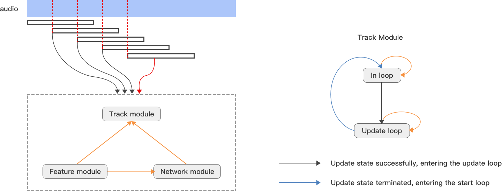
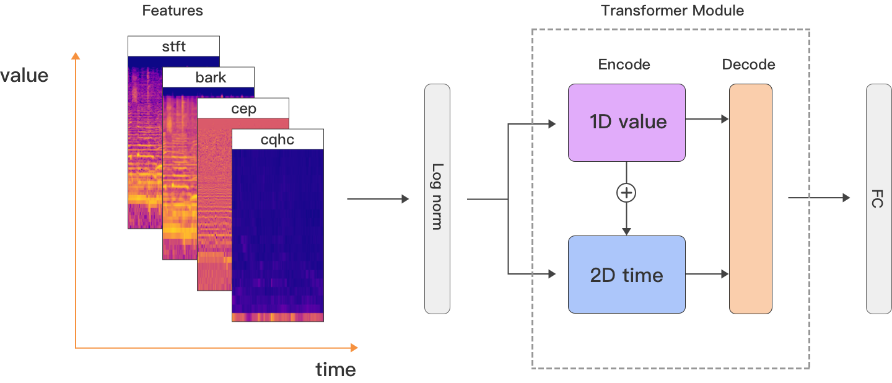

 

# FastTune

<!-- A tuner for guitar, ukulele, bass, banjo, mandolin, violin and etc. -->
 

**FastTune** is an AI tuner for guitar, ukulele, bass, banjo, mandolin, violin and etc.  
  
It utilizes the transformer-based tuneNN network model for abstract timbre modeling, supporting tuning for 12+ instrument types.   


<!--   -->

| Instrument  |  Surpport  | String  | More |         
| ------ |  ------ |  ------ |  ------ |    
| Guitar |  ✅|6-string, 4-string, 7-string, 12-string  |30+ tune-mode; acoustic, electric,  overdriven and etc|
| Ukulele | ✅ |4-string | 4+ tune-mode| 
| Bass|  ✅|4-string, 5-string| 18+ tune-mode; acoustic, electric, slap and etc | 
| Banjo | ✅| 4-string | 3+ tune-mode |  
| Mandolin |  ✅| 8-string |  standard tune-mode | 
| Violin/Viola/Cello |  ✅| 4-string | standard tune-mode | 

The online experience based on web audio and wasm, [See the site here](https://aifasttune.com)

<!-- 
### Table of Contents
- [Feature](#feature)
- [Principle](#principle)
	- [Classic Algorithm](#classic-algorithm)
	- [FastTune Architecture](#fasttune-architecture)
	- [TuneNN](#tunenn)
- [Dataset](#dataset) -->

## Feature

- **`accurate`**&nbsp;&nbsp;For all the mentioned instruments, it can accurately identify the low, mid, and high-frequency regions, with a frequency range from 30Hz to 2000Hz. For each stage of a musical note, from onset to decay, the model output is combined with real-time tracking and correction using the Wigner-Ville distribution. It can accurately reflect the changes in pitch and subtle fluctuations in each stage of the ADSR of the musical note, with intonation errors within a range of 0.5% of a musical semitone.
- **`fast`**&nbsp;&nbsp; Quick response, nearly approaching the endpoints and onset stages of musical notes, faster by 100ms-200ms compared to most algorithms. Swift responses to string plucking, string cutting, and fret releasing.
- **`smooth `**&nbsp;&nbsp; String twisting tuning, smooth and seamless, accurate and responsive to pitch bending. Continuous tuning, finger movements, fast and authentic, resembling the heartbeat pulse. Every pluck of the fingers provides precise and real-time feedback.   

<p align="center">
  <a target="_blank" href="https://aifasttune.com"></a>
</p>

## Principle
For pitch tracking across various instruments, there are currently common issues with latency and accuracy.

- **`latency issue`**&nbsp;&nbsp; Some instruments exhibit strong structural resonances at the onset, and the interference from these resonant peaks varies across instrument categories. The intensity and duration of the resonance peaks differ as well. Taking the guitar as an example, it shows strong resonance peak interference, even surpassing the fundamental frequency of the timbre. The duration of this interference is long, reaching 200ms or more. Strong resonance peaks pose significant challenges to recognition. Many algorithms adopt strategies such as correlating probabilities with consecutive packets before and after or introducing latency to reduce the risk of resonance peak interference.  
- **`accuracy issue`**&nbsp;&nbsp;Due to the complexity of instrument timbre, achieving 100% accurate recognition is extremely challenging. This difficulty arises from significant variations in the timbre at different stages of a musical note. It is challenging to accurately identify data for each stage of the ADSR (Attack, Decay, Sustain, Release) process from the beginning to the end of a musical note. The issue is further complicated by the wide range of frequencies, with extreme differences in timbre between very low and very high frequencies.

### Classic Algorithm     
For pitch estimation, there are many related algorithms, mainly based on frequency domain processing or autocorrelation processing. We have conducted numerous evaluations and comparisons using the following algorithms:  

- **`PEF`** - A pitch estimation filter is designed, and pitch is estimated by performing cross-correlation operations in the frequency domain.
- **`NCF`** - Pitch is estimated using normalized time-domain autocorrelation.
- **`HPS/LHS`** -  Pitch is estimated by adopting dot or sum operations on the harmonics of the spectrum.
- **`CEP`** - Pitch is estimated by performing a second FFT transformation on the spectrum and using cepstral analysis.
- **`YIN`** - Pitch is estimated using time-domain differential autocorrelation.

The command line tools:   

```bash 
$ pitch -p pef -r 32000 -i test.wav -o test.txt

```
> `-p`, `--pitch`,  select pitch detection algorithm, include `pef`|`ncf`|`hps`|`lhs`|`cep`|`yin`  
> `-r`, `--samplate`, select samplerate   
> `-h`, `--help`, all parameter information  

Considering the characteristics of the above algorithms, for low-frequency pitch estimation of musical instruments (below 55Hz), most algorithms, except HPS/LHS, are ineffective. However, HPS/LHS performs relatively poorly in high-frequency pitch estimation (above 1000Hz). All algorithms face challenges of strong resonant peak interference and misjudgments. PEF shows better performance in handling pitch-related resonant peaks. In scenarios with slightly stronger background noise, the latency of all algorithms rapidly increases.


### FastTune Architecture  
In order to better address the two issues mentioned above, FastTune is designed with three modules, and their specific relationships are as follows:

 
 

- **`track module`**  - &nbsp;&nbsp;Responsible for identifying entry points, updating, and terminating loops. Manages mutual communication between the feature module and network module, as well as real-time tracking and correction using Wigner-Ville distribution (WVD).   
- **`feature module`**  - &nbsp;&nbsp;Extracting feature peaks, harmonics, endpoints, STFT spectrum, Bark spectrum, cepstrum, CQHC, etc.  
- **`network module`**  - &nbsp;&nbsp;TNN deep learning network model, responsible for identification.


### TuneNN
The timbre of musical notes is the result of various combinations and transformations of harmonic relationships, harmonic strengths and weaknesses, instrument resonant peaks, and structural resonant peaks over time.   


 

- **STFT spectrum**,  the most primitive spectrum, can accurately reflect the harmonic relationships and strengths of harmonics in musical notes. 
- **Bark spectrum**, more accurate than Mel spectrum in accordance with psychoacoustic perception of the human ear, is a nonlinear compression of the STFT spectrum. It belongs to a psychoacoustic abstraction feature that focuses on the harmonic relationships and strengths.   
- **Cepstrum**,  the envelope characteristics of instrument resonant peaks.
- **CQHC**,  MFCC features are designed to address pitch variations in speech. Based on CQT, CQCC can better reflect instrument resonant peaks and structural resonant peaks, while CQHC, using a deconvolution approach, yields more prominent results compared to CQCC. 

**1D value** and **2D time** transformer processed with sliding adjacent windows.  
<p align="center">
	 
</p>
<p align="center">
 
</p>

Specific feature extraction can be referred to in `featureExtract.py`, and the model structure can be referred to in `tuneNN.py`.

## Dataset
Due to the diversity of instruments and the complexity of timbres, for the guitar instrument, we collected 300+ different brands and price-range guitars, comprising a training and testing dataset of 100GB. The brands include Yamaha, Fender, Gibson, Guild, Taylor, Martin, Enya, Rosen, Mosen, Weibo, Saga, Kama, and more, totaling 50+ brands with different price ranges from 10\$ to 5000\$.

A robust dataset is crucial for training network models. Our goal is not only to share the code but also actively preparing to publicly release the training and testing datasets. While we cannot currently commit to a specific release date, please be assured that the intention to provide access to the dataset is firm.   

Thank you for your understanding and continued support.


